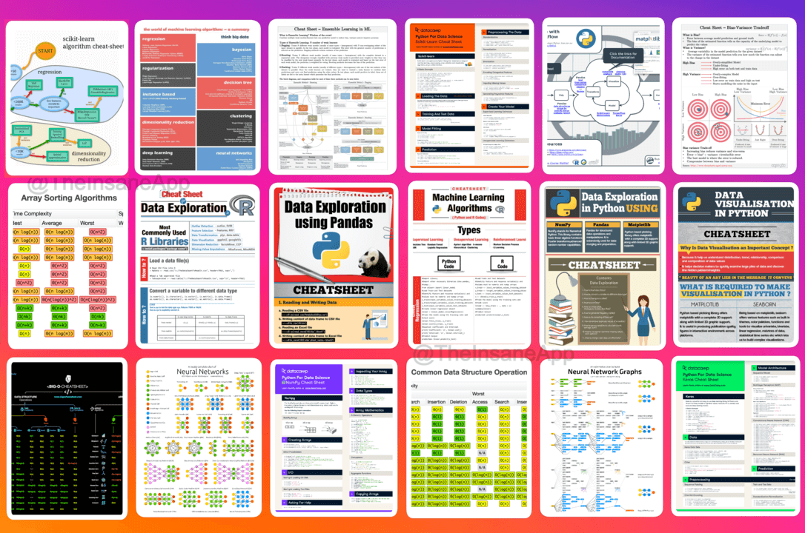

# My AI-ML Learning Resources 🚀

  

## 🗺️ AI-ML Learning Roadmap

  

---

## 🧠 Core Learning Resources

### 🤖 Artificial Intelligence

  <h4>VIP Cheatsheets</h4>
  <table>
    <tr>
      <td align="center"> Reflex-based models</td>
      <td align="center"> States-based models</td>
      <td align="center"> Variables-based models</td>
      <td align="center"> Logic-based models</td>
    </tr>
  </table>

  <h4>Super VIP Cheatsheet</h4>
  <table>
    <tr>
      <td align="center"> All the above gathered in one place</td>
    </tr>
  </table>

### 🧠 Deep Learning

  <h4>VIP Cheatsheets</h4>
  <table>
    <tr>
      <td align="center"> Convolutional Neural Networks</td>
      <td align="center"> Recurrent Neural Networks</td>
      <td align="center"> Tips and tricks</td>
    </tr>
  </table>

  <h4>Super VIP Cheatsheet</h4>
  <table>
    <tr>
      <td align="center"> All the above gathered in one place</td>
    </tr>
  </table>

### 🤖 Machine Learning

  <h4>VIP Cheatsheets</h4>
  <table>
    <tr>
      <td align="center"> Supervised Learning</td>
      <td align="center"> Unsupervised Learning</td>
      <td align="center"> Deep Learning</td>
      <td align="center"> Tips and tricks</td>
    </tr>
  </table>

  <h4>VIP Refreshers</h4>
  <table>
    <tr>
      <td align="center"> Probabilities and Statistics</td>
      <td align="center"> Algebra and Calculus</td>
    </tr>
  </table>

  <h4>Super VIP Cheatsheet</h4>
  <table>
    <tr>
      <td align="center"> All the above gathered in one place</td>
    </tr>
  </table>

### 🗣️ Large Language Models & Transformers

  <h4>VIP Cheatsheet</h4>
  

---
## 📚 Complete Resources Link

For easy access and offline viewing, I've also uploaded these resources to [Google Drive](https://drive.google.com/drive/folders/1yReFa2Af9icmdEaAYOUocepkQk_gGJJK?usp=sharing).

## The structure of the folder

- 01- [**Mathematics**](https://github.com/Kishan-Patel-dev/AI-ML-cheatsheets/tree/main/01-%20Mathematics) 
- 02- [**C++**](https://github.com/Kishan-Patel-dev/AI-ML-cheatsheets/tree/main/02-%20C%2B%2B) 
- 03- [**Python**](https://github.com/Kishan-Patel-dev/AI-ML-cheatsheets/tree/main/03-%20Python) 
- 04- [**Computer architecture**](https://github.com/Kishan-Patel-dev/AI-ML-cheatsheets/tree/main/04-%20Computer%20architecture) 
- 05- [**Data structures**](https://github.com/Kishan-Patel-dev/AI-ML-cheatsheets/tree/main/05-%20Data%20structures) 
- 06- [**Automata theory**](https://github.com/Kishan-Patel-dev/AI-ML-cheatsheets/tree/main/06-%20Automata%20theory) 
- 06- [**Complexity theory**](https://github.com/Kishan-Patel-dev/AI-ML-cheatsheets/tree/main/06-%20Complexity%20theory) 
- 07- [**SQL**](https://github.com/Kishan-Patel-dev/AI-ML-cheatsheets/tree/main/07-%20SQL) 
- 08- [**Data cleaning**](https://github.com/Kishan-Patel-dev/AI-ML-cheatsheets/tree/main/08-%20Data%20cleaning) 
- 09- [**Data visualization**](https://github.com/Kishan-Patel-dev/AI-ML-cheatsheets/tree/main/09-%20Data%20visualization) 
- 10- [**Mathematical logic**](https://github.com/Kishan-Patel-dev/AI-ML-cheatsheets/tree/main/10-%20Mathematical%20logic) 
- 11- [**Introduction to AI**](https://github.com/Kishan-Patel-dev/AI-ML-cheatsheets/tree/main/11-%20Introduction%20to%20AI) 
- 12- [**Machine learning**](https://github.com/Kishan-Patel-dev/AI-ML-cheatsheets/tree/main/12-%20Machine%20learning) 
- 13- [**Deep learning**](https://github.com/Kishan-Patel-dev/AI-ML-cheatsheets/tree/main/13-%20Deep%20learning) 
- 14- [**Metrics to evaluate ML algorithms**](https://github.com/Kishan-Patel-dev/AI-ML-cheatsheets/tree/main/14-%20Metrics%20to%20evaluate%20machine%20learning%20algorithms) 
- 15- [**Reinforcement learning**](https://github.com/Kishan-Patel-dev/AI-ML-cheatsheets/tree/main/15-%20Reinforcement%20learning) 
- 16- [**Time series**](https://github.com/Kishan-Patel-dev/AI-ML-cheatsheets/tree/main/16-%20Time%20series) 
- 17- [**Git**](https://github.com/Kishan-Patel-dev/AI-ML-cheatsheets/tree/main/17-%20Git) 

## The content of the folder

- 01- [**Mathematics**](https://github.com/Kishan-Patel-dev/AI-ML-cheatsheets/tree/main/01-%20Mathematics) 
  - Calculus cheat sheet all reduced
  - Calculus cheat sheet
  - Linear Algebra in 4 pages
  - Probability cheat sheet
  - Probability distribution cheat sheet
  - Statistics cheat sheet
  - Super-cheatsheet-mathematics
  - Summary statistics
- 02- [**C++**](https://github.com/Kishan-Patel-dev/AI-ML-cheatsheets/tree/main/02-%20C%2B%2B) 
  - C++ Reference Card
  - C++ Libraries
  - C++ OOP Reference Card
- 03- [**Python**](https://github.com/Kishan-Patel-dev/AI-ML-cheatsheets/tree/main/03-%20Python) 
  - Python for Beginners
  - Python Reference Cheatsheet
  - Python cheatsheet
  - Python for Data Science cheatsheet
  - Numpy cheatsheet
  - Pandas cheatsheet 1
  - Pandas cheatsheet 2
  - Matplotlib cheatsheet 1
  - Matplotlib cheatsheet 2
  - Scikit-Learn cheatsheet
  - List, Tuples, Sets, Dictionary
  - Tutorial Python
- 04- [**Computer architecture**](https://github.com/Kishan-Patel-dev/AI-ML-cheatsheets/tree/main/04-%20Computer%20architecture) 
  - Computer organisation cheatsheet
- 05- [**Data structures**](https://github.com/Kishan-Patel-dev/AI-ML-cheatsheets/tree/main/05-%20Data%20structures) 
  - Classification of Data structures
  - Data structures
  - Complexity
  - Resources
- 06- [**Automata theory**](https://github.com/Kishan-Patel-dev/AI-ML-cheatsheets/tree/main/06-%20Automata%20theory) 
  - Languages and Automata cheathseet
  - Automata cheatsheet
  - Context-Free Grammar cheatsheet
- 06- [**Complexity theory**](https://github.com/Kishan-Patel-dev/AI-ML-cheatsheets/tree/main/06-%20Complexity%20theory) 
  - Complexity Theory Cheat Sheet
  - Computability Theory Cheat Sheet
- 07- [**SQL**](https://github.com/Kishan-Patel-dev/AI-ML-cheatsheets/tree/main/07-%20SQL) 
  - SQL-quick-guide
  - SQL operations
  - SQL query execution order
  - SQL commands
  - SQL-basics-cheat-sheet-a4
  - SQL joins-cheat-sheet-a4
  - Study-guide-data-retrieval-with-SQL
  - SQL Roadmap
- 08- [**Data cleaning**](https://github.com/Kishan-Patel-dev/AI-ML-cheatsheets/tree/main/08-%20Data%20cleaning) 
  - Data-cleaning-checklist
  - Data-cleaning-guide
  - Data-preparation-cheatsheet
  - Feature engineering
  - Feature-selection-methods
  - Hypothesis-testing-cheatsheet
- 09- [**Data visualization**](https://github.com/Kishan-Patel-dev/AI-ML-cheatsheets/tree/main/09-%20Data%20visualization) 
  - Core principles of Data Visualization
  - Visual Vocabulary
  - Data visualization cheatsheet
  - The chart chooser
  - From Data to Visualization
- 10- [**Mathematical logic**](https://github.com/Kishan-Patel-dev/AI-ML-cheatsheets/tree/main/10-%20Mathematical%20logic) 
  - cheatsheet-logic-models
- 11- [**Introduction to AI**](https://github.com/Kishan-Patel-dev/AI-ML-cheatsheets/tree/main/11-%20Introduction%20to%20AI) 
  - cheatsheet-states-models
  - cheatsheet-variables-models
- 12- [**Machine learning**](https://github.com/Kishan-Patel-dev/AI-ML-cheatsheets/tree/main/12-%20Machine%20learning) 
  - Machine learning process
  - Machine-learning-map
  - Machine learning algorithms
  - How to choose a ML algorithm 1
  - How to choose a ML algorithm 2
  - Time complexity of ML algorithms
  - Comparison of ML algorithms 1
  - Comparison of ML algorithms 2
  - Comparison of ML algorithms 3
  - Comparison of ML algorithms 4
  - Comparison of ML algorithms 5
  - super-cheatsheet-machine-learning
  - Machine learning cheatsheets
  - Machine learning explainability
  - Machine learning operations MLOps
- 13- [**Deep learning**](https://github.com/Kishan-Patel-dev/AI-ML-cheatsheets/tree/main/13-%20Deep%20learning) 
  - super-cheatsheet-deep-learning
  - Large Language Models cheatsheet
  - main types of neural networks
  - Architecture - Classification MLP
  - Architecture - Regression MLP
  - Activation Function - Hidden Layer
  - Activation Function - Output Layer
  - Activation Functions
- 14- [**Metrics to evaluate ML algorithms**](https://github.com/Kishan-Patel-dev/AI-ML-cheatsheets/tree/main/14-%20Metrics%20to%20evaluate%20machine%20learning%20algorithms) 
  - Metrics-machine-learning
  - Performance-measure-machine-learning 
- 15- [**Reinforcement learning**](https://github.com/Kishan-Patel-dev/AI-ML-cheatsheets/tree/main/15-%20Reinforcement%20learning) 
  - Reinforcement learning cheatsheet 1
  - Reinforcement learning cheatsheet 2 
- 16- [**Time series**](https://github.com/Kishan-Patel-dev/AI-ML-cheatsheets/tree/main/16-%20Time%20series) 
  - Time-series-cheat-sheet 
- 17- [**Git**](https://github.com/Kishan-Patel-dev/AI-ML-cheatsheets/tree/main/17-%20Git) 
  - Git-cheat-sheet
  - Git-cheat-sheet 2

## 📚 Additional Resources
- [Comprehensive ML CheatSheet](https://www.kaggle.com/discussions/getting-started/128400)
- [ML Interview CheatSheet](ML_cheatsheets.pdf)
- [LLM CheatSheet](Large%20Language%20Model%20Cheat%20Sheet.pdf)

---

## 👨‍💻 About Me

  <h3>KISHAN PATEL</h3>
  
<strong>Ideas to REALITY</strong> | OSS Contributor | GSoC'25 Aspirant

### 🚀 What I Do
- Building **AI Agents** and **Generative AI Projects** with a focus on real-world usability and scalability
- Exploring the frontier of **Generative AI**, **Autonomous Agents**, and **LLM-driven systems**
- Contributing to [Rocket.Chat](https://github.com/rocketChat/) and [Openlit](https://github.com/openlit/)

### 🛠️ Tech Stack
- TypeScript, Node.js, MongoDB, Express
- LLMs and LangGraph frameworks
- Full-stack web development

### 🌐 Connect With Me

  
  
  

---

  Built with ❤️ by Kishan Patel

